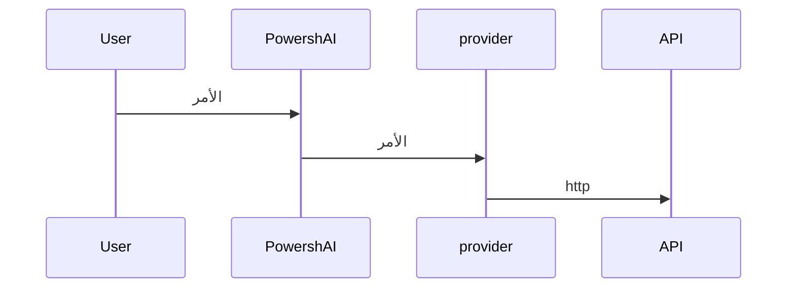

# مقدمي الخدمات  

# ملخص <!--! @#Short -->  

المقدمي خدمات هي سكربتات داخل PowershAI تحتوي على المنطق للتواصل والتعامل مع ردود APIs خدمات الذكاء الاصطناعي.

# تفاصيل  <!--! @#Long -->  

أحد أركان PowershAI هو المقدمي خدمات.  
المقدمي خدمات ينفذون الأوامر التي تصل إلى APIs المحددة.  

أساساً، المقدمي خدمات هي سكربتات تحتوي على المنطق لإرسال واستقبال البيانات من APIs ذلك المقدمي.  
في هذه السكربتات توجد كل المنطق الفريدة والمميزة لكل مقدمي خدمات.  
PowershAI يوفر وظائف عامة، مما يتيح تنسيق الطريقة التي يتم بها استدعاء بعض خدمات الذكاء الاصطناعي.  



على سبيل المثال، مقدمي خدمات OpenAI يوفر وظيفة `Get-OpenaiChat`، التي ترسل استكمال محادثة إلى API OpenAI، وفقاً للقواعد الموثقة.  
بينما مقدمي خدمات Google، يوفر وظيفة `Invoke-GoogleGenerateContent`، التي تتواصل مع Gemini وتستقبل الرد.  
بالنسبة للمستخدم، يوفر PowershAI الأمر `Get-AiChat`، الذي يمكن أن يستدعي إما `Get-OpenaiChat` أو `Invoke-GoogleGenerateContent`، اعتماداً على أي مقدمي خدمات نشط.  
المعلمات لـ `Get-AiChat` موحدة وموثقة، ويجب على كل مقدمي خدمات رسم الخرائط للاستدعاءات المقابلة.  
هناك معيار موثق حول كيفية تنفيذ المقدمي خدمات للوظائف بحيث يمكن توصيلها في نظام PowershAI.  

على الرغم من هذا التوحيد، الذي يسهل استخدام الأوامر العامة لـ PowershAI، إلا أن المستخدم حر في استخدام الأوامر مباشرة من كل مقدمي خدمات.  
PowershAI لا يمنع الوصول إلى الأوامر الأساسية لكل مقدمي خدمات، مما يجعله مرنًا للغاية، مما يسمح أيضًا للمستخدم بتعديل وتكييف حسب الحاجة (عبر بروكسي، على سبيل المثال).

فكرة PowershAI هي أن تكون مرنة على عدة مستويات:

- وجود أوامر قياسية، تسمح بسهولة بتغيير مقدمي خدمات الذكاء الاصطناعي للعمليات الشائعة، مثل المحادثة مع LLM 
- توفير الوصول المباشر إلى الأوامر التي تغلف الاستدعاءات إلى APIs

## الحصول على قائمة المقدمي خدمات  

يمكنك الحصول على قائمة المقدمي خدمات المنفذة بعدة طرق.  
الأولى هي استخدام الأمر `Get-AiProviders`.  

إذا كنت ترى هذه الوثيقة عبر Get-Help، يمكنك استخدام الأمر Get-Help about_Powershell_`اسم_المقدمي`، للحصول على مزيد من التفاصيل.  
إذا كنت ترى عبر مستودع Git، يمكنك الاستعلام مباشرة بالوصول إلى المجلد الفرعي باسم المقدمي.  

أيضًا، يمكن التحقق من قائمة المقدمي خدمات المدعومة و/أو التي يتم تنفيذها في القضية #3.

# أمثلة <!--! @#Ex -->

## قائمة المقدمي خدمات 

```powershell 
Get-AiProviders 
```

## قائمة المساعدة حول مقدمي خدمات محدد 

```
Get-Help about_Powershai_huggingface
Get-Help about_Powershai_openai
```


_تمت الترجمة تلقائيًا باستخدام PowershAI و IA_
