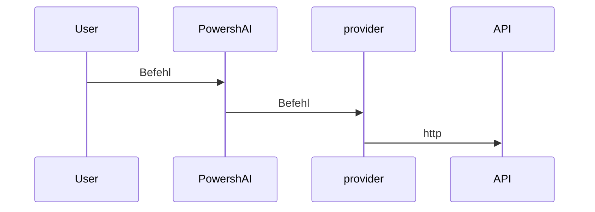

# Anbieter  

# ZUSAMMENFASSUNG <!--! @#Short --> 

Anbieter sind Skripte innerhalb von PowershAI, die die Logik für die Kommunikation und die Behandlung von Antworten aus den APIs der KI-Dienste enthalten.

# DETAILS  <!--! @#Long --> 

Einer der Eckpfeiler von PowershAI sind die Anbieter.  
Die Anbieter implementieren die Befehle, die auf die spezifischen APIs zugreifen.  

Im Wesentlichen sind Anbieter Skripte, die die Logik zum Senden und Empfangen von Daten aus den APIs dieses Anbieters enthalten.  
In diesen Skripten befindet sich die gesamte Logik, die für jeden Anbieter einzigartig und speziell ist.  
PowershAI bietet generische Funktionen, die die Art und Weise standardisieren, wie bestimmte KI-Dienste aufgerufen werden.  



So bietet der Anbieter von OpenAI beispielsweise die Funktion `Get-OpenaiChat`, die einen Chat-Abschluss an die API von OpenAI sendet, gemäß den dokumentierten Regeln.  
Der Anbieter von Google bietet dagegen die Funktion `Invoke-GoogleGenerateContent`, die den Chat für Gemini startet und die Antwort empfängt.  
Für den Benutzer bietet Powershai den Befehl `Get-AiChat`, der entweder `Get-OpenaiChat` oder `Invoke-GoogleGenerateContent` aufrufen kann, je nachdem welcher Anbieter aktiv ist.  
Die Parameter von `Get-AiChat` sind standardisiert und dokumentiert, und jeder Anbieter muss die entsprechenden Aufrufe zuordnen.  
Es gibt einen dokumentierten Standard, wie Anbieter die Funktionen implementieren müssen, damit sie in das PowershAI-Ökosystem integriert werden können.  


Trotz dieser Standardisierung, die die Verwendung der globalen Befehle von PowershAI erleichtert, ist der Benutzer frei, die Befehle direkt von jedem Anbieter zu verwenden.  
PowershAI verhindert nicht den Zugriff auf die Basisbefehle jedes Anbieters, was es sehr flexibel macht und es dem Benutzer ermöglicht, es bei Bedarf (z. B. über einen Proxy) zu ändern und anzupassen.

Die Idee von PowershAI ist es, auf verschiedenen Ebenen flexibel zu sein:

- Standardbefehle zu haben, die es ermöglichen, den KI-Anbieter für allgemeine Vorgänge wie den Chat mit einem LLM einfach zu wechseln
- Direkten Zugriff auf die Befehle zu ermöglichen, die die Aufrufe an die APIs verkapseln

## Abrufen der Liste der Anbieter  

Sie können die Liste der implementierten Anbieter auf verschiedene Arten abrufen.  
Die erste ist die Verwendung des Befehls `Get-AiProviders`.  

Wenn Sie diese Dokumentation über Get-Help sehen, können Sie den Befehl Get-Help about_Powershell_`NameProvider` verwenden, um weitere Informationen zu erhalten.  
Wenn Sie im Git-Repository suchen, können Sie direkt auf das Unterverzeichnis mit dem Namen des Anbieters zugreifen.

Auch die Liste der unterstützten oder implementierten Anbieter kann in Issue #3 eingesehen werden.


# BEISPIELE <!--! @#Ex -->

## Auflisten der Anbieter 

```powershell 
Get-AiProviders 
```

## Auflisten der Hilfe zu einem bestimmten Anbieter 

```
Get-Help about_Powershai_huggingface
Get-Help about_Powershai_openai
```


<!--PowershaiAiDocBlockStart-->
_Automatisch übersetzt mit PowershAI und KI 
_
<!--PowershaiAiDocBlockEnd-->
