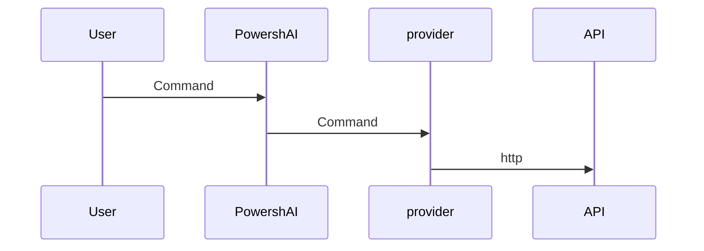

# Providers  

# SUMMARY <!--! @#Short --> 

Providers are scripts within PowershAI that contain the logic to communicate and handle the responses from the APIs of AI services.

# DETAILS  <!--! @#Long --> 

One of the pillars of PowershAI are the providers.  
Providers implement the commands that access specific APIs.  

Basically, providers are scripts that contain the logic to send and receive data from the APIs of that provider.  
These scripts hold all the logic that is unique and peculiar to each provider.  
PowershAI provides generic functions that standardize the way certain AI services are invoked.  



For example, the OpenAI provider offers the function `Get-OpenaiChat`, which sends a chat completion to the OpenAI API, following the documented rules.  
On the other hand, the Google provider offers the function `Invoke-GoogleGenerateContent`, which chats with Gemini and receives the response.  
For the user, PowershAI provides the command `Get-AiChat`, which can either invoke `Get-OpenaiChat` or `Invoke-GoogleGenerateContent`, depending on which provider is active.  
The parameters of `Get-AiChat` are standardized and documented, and each provider must map the corresponding calls.  
There is a documented standard for how providers should implement functions so that they can be plugged into the PowershAI ecosystem.  

Despite this standardization, which makes it easier to use the global commands of PowershAI, the user is free to use the commands directly from each provider.  
PowershAI does not restrict access to the base commands of each provider, making it quite flexible, allowing users to modify and adjust as needed (via proxy, for instance).

The idea of PowershAI is to be flexible at various levels:

- Have standard commands that allow easy switching of the AI provider for common operations, such as chatting with an LLM 
- Provide direct access to the commands that encapsulate the calls to the APIs

## Obtaining the list of providers  

You can obtain the list of implemented providers in several ways.  
The first is by using the command `Get-AiProviders`.  

If you are viewing this documentation via Get-Help, you can use the command Get-Help about_Powershell_`ProviderName`, to obtain more details.  
If you are viewing it from the Git repository, you can directly consult by accessing the subdirectory with the name of the provider.

Also, the list of supported and/or being implemented providers can be checked in issue #3.


# EXAMPLES <!--! @#Ex -->

## Listing the providers 

```powershell 
Get-AiProviders 
```

## Listing the help about a specific provider 

```
Get-Help about_Powershai_huggingface
Get-Help about_Powershai_openai
```


_Automatically translated using PowershAI and AI._
