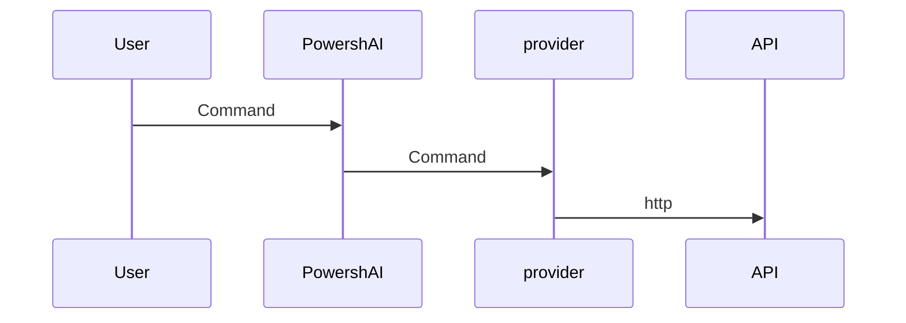

# Providers  

# SUMMARY <!--! @#Short --> 

Providers are scripts within PowershAI that contain the logic to communicate and handle responses from the IA service APIs.

# DETAILS  <!--! @#Long --> 

One of the pillars of PowershAI are the providers.  
Providers implement the commands that access specific APIs.  

Basically, providers are scripts that contain the logic to send and receive data from the APIs of that provider.  
These scripts contain all the logic that is unique and peculiar to each provider.  
PowershAI provides generic functions that standardize the way certain IA services are invoked.  



For example, the OpenAI provider provides the `Get-OpenaiChat` function, which sends a chat completion to the OpenAI API, following the documented rules.  
The Google provider, on the other hand, provides the `Invoke-GoogleGenerateContent` function, which chats to Gemini and receives the response.  
For the user, Powershai provides the `Get-AiChat` command, which can either invoke `Get-OpenaiChat` or `Invoke-GoogleGenerateContent`, depending on which provider is active.  
The parameters of `Get-AiChat` are standardized and documented, and each provider must map the corresponding calls.  
There is a documented standard for how providers should implement functions so that they can be plugged into the PowershAI ecosystem.  


Despite this standardization, which makes it easy to use PowershAI's global commands, the user is free to use the commands directly from each provider.  
PowershAI does not prevent access to the base commands of each provider, and this makes it quite flexible, allowing, among other things, the user to modify and adjust as needed (via proxy, for example).

PowershAI's idea is to be flexible on several levels:

- Have standard commands that allow you to easily switch the IA provider for common operations, such as chatting with an LLM 
- Provide direct access to the commands that encapsulate the calls to the APIs

## Obtaining the list of providers  

You can obtain the list of implemented providers in several ways.  
The first is using the `Get-AiProviders` command.  

If you are viewing this documentation via Get-Help, you can use the command Get-Help about_Powershell_`NomeProvider`, to get more details.  
If you are viewing it through the Git repository, you can consult directly by accessing the subdirectory with the provider's name.

Also, the list of supported and/or being implemented providers can be checked in issue #3.


# EXAMPLES <!--! @#Ex -->

## Listing the providers 

```powershell 
Get-AiProviders 
```

## Listing help about a specific provider 

```
Get-Help about_Powershai_huggingface
Get-Help about_Powershai_openai
```


<!--PowershaiAiDocBlockStart-->
_Automatically translated using PowershAI and AI_
<!--PowershaiAiDocBlockEnd-->
