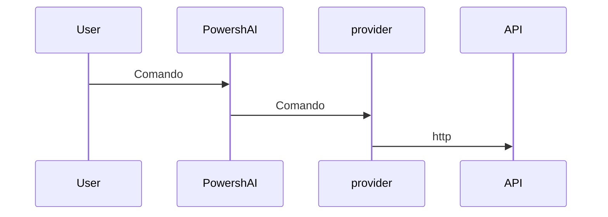

# Proveedores  

# RESUMEN <!--! @#Short --> 

Los proveedores son scripts dentro de PowershAI que contienen la lógica para comunicarse y procesar las respuestas de las APIs de los servicios de IA.

# DETALLES  <!--! @#Long --> 

Uno de los pilares de PowershAI son los proveedores.  
Los proveedores implementan los comandos que acceden a las APIs específicas.  

Básicamente, los proveedores son scripts que contienen la lógica para enviar y recibir los datos de las APIs de ese proveedor.  
En estos scripts está toda la lógica que es única y peculiar de cada proveedor.  
PowershAI proporciona funciones genéricas, que estandarizan la forma en que se invocan ciertos servicios de IA.  



Por ejemplo, el proveedor de OpenAI proporciona la función `Get-OpenaiChat`, que envía un chat completion a la API de OpenAI, siguiendo las reglas documentadas.  
Mientras que el proveedor de Google, proporciona la función `Invoke-GoogleGenerateContent`, que chatea con Gemini y recibe la respuesta.  
Para el usuario, Powershai proporciona el comando `Get-AiChat`, que puede invocar tanto a `Get-OpenaiChat` como a `Invoke-GoogleGenerateContent`, dependiendo de qué proveedor esté activo.  
Los parámetros de  `Get-AiChat` están estandarizados y documentados, y cada proveedor debe mapear las llamadas correspondientes.  
Existe un patrón documentado de cómo los proveedores deben implementar las funciones para que se integren en el ecosistema de PowershAI.  


A pesar de esta estandarización, que facilita el uso de los comandos globales de PowershAI, el usuario es libre de usar los comandos directamente de cada proveedor.  
PowershAI no impide el acceso a los comandos base de cada proveedor, y esto lo hace bastante flexible, permitiendo incluso que el usuario modifique y ajuste según sea necesario (mediante un proxy, por ejemplo).

La idea de PowershAI es ser flexible en varios niveles:

- Tener comandos estándar, que permitan cambiar fácilmente el proveedor de IA para operaciones comunes, como chatear con un LLM 
- Proporcionar acceso directo a los comandos que encapsulan las llamadas a las APIs

## Obteniendo la lista de proveedores  

Puede obtener la lista de proveedores implementados de varias maneras.  
La primera es utilizando el comando `Get-AiProviders`.  

Si está viendo esta documentación a través de Get-Help, puede usar el comando Get-Help about_Powershell_`NombreProvider`, para obtener más detalles.  
Si está viendo el repositorio Git, puede consultar directamente accediendo al subdirectorio con el nombre del proveedor.

También, la lista de proveedores soportados y/o que se están implementando se puede consultar en la issue #3.


# EJEMPLOS <!--! @#Ex -->

## Listando los proveedores 

```powershell 
Get-AiProviders 
```

## Listando el help sobre un proveedor específico 

```
Get-Help about_Powershai_huggingface
Get-Help about_Powershai_openai
```


<!--PowershaiAiDocBlockStart-->
_Traducido automáticamente usando PowershAI e IA. 
_
<!--PowershaiAiDocBlockEnd-->
