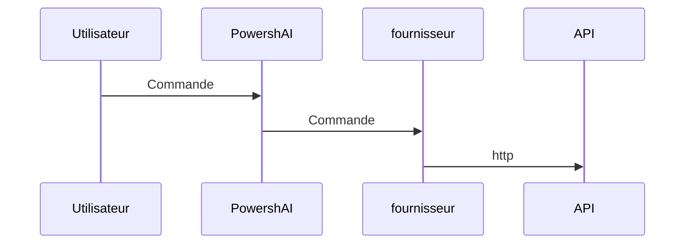

# Fournisseurs  

# RÉSUMÉ <!--! @#Short -->  

Les fournisseurs sont des scripts au sein de PowershAI qui contiennent la logique pour communiquer et traiter les réponses des API des services d'IA.

# DÉTAILS <!--! @#Long -->  

Un des piliers de PowershAI sont les fournisseurs.  
Les fournisseurs implémentent les commandes qui accèdent aux API spécifiques.  

Fondamentalement, les fournisseurs sont des scripts qui contiennent la logique pour envoyer et recevoir les données des API de ce fournisseur.  
Dans ces scripts se trouve toute la logique qui est unique et particulière à chaque fournisseur.  
PowershAI fournit des fonctions génériques, qui standardisent la manière dont certains services d'IA sont invoqués.  



Par exemple, le fournisseur d'OpenAI fournit la fonction `Get-OpenaiChat`, qui envoie une complétion de chat à l'API d'OpenAI, suivant les règles documentées.  
Le fournisseur de Google, quant à lui, fournit la fonction `Invoke-GoogleGenerateContent`, qui envoie le chat à Gemini et reçoit la réponse.  
Pour l'utilisateur, PowershAI fournit la commande `Get-AiChat`, qui peut invoquer soit `Get-OpenaiChat` soit `Invoke-GoogleGenerateContent`, selon le fournisseur actif.  
Les paramètres de `Get-AiChat` sont standardisés et documentés, et chaque fournisseur doit mapper les appels correspondants.  
Il existe un modèle documenté de la manière dont les fournisseurs doivent implémenter les fonctions pour qu'elles soient intégrées dans l'écosystème de PowershAI.  

Malgré cette standardisation, qui facilite l'utilisation des commandes globales de PowershAI, l'utilisateur est libre d'utiliser les commandes directement de chaque fournisseur.  
PowershAI n'empêche pas l'accès aux commandes de base de chaque fournisseur, ce qui le rend assez flexible, permettant même à l'utilisateur de modifier et d'ajuster selon ses besoins (via proxy, par exemple).

L'idée de PowershAI est d'être flexible à plusieurs niveaux :

- Avoir des commandes standards, qui permettent de changer facilement le fournisseur d'IA pour des opérations courantes, comme le chat avec un LLM 
- Fournir un accès direct aux commandes qui encapsulent les appels aux API

## Obtenir la liste des fournisseurs  

Vous pouvez obtenir la liste des fournisseurs implémentés de plusieurs manières.  
La première est d'utiliser la commande `Get-AiProviders`.  

Si vous consultez cette documentation via Get-Help, vous pouvez utiliser la commande Get-Help about_Powershell_`NomFournisseur`, pour obtenir plus de détails.  
Si vous la consultez via le dépôt Git, vous pouvez vérifier directement en accédant au sous-répertoire portant le nom du fournisseur.

De plus, la liste des fournisseurs pris en charge et/ou qui sont en cours d'implémentation peut être consultée dans l'issue #3.

# EXEMPLES <!--! @#Ex -->  

## Lister les fournisseurs  

```powershell 
Get-AiProviders 
```

## Lister l'aide sur un fournisseur spécifique  

```
Get-Help about_Powershai_huggingface
Get-Help about_Powershai_openai
```
