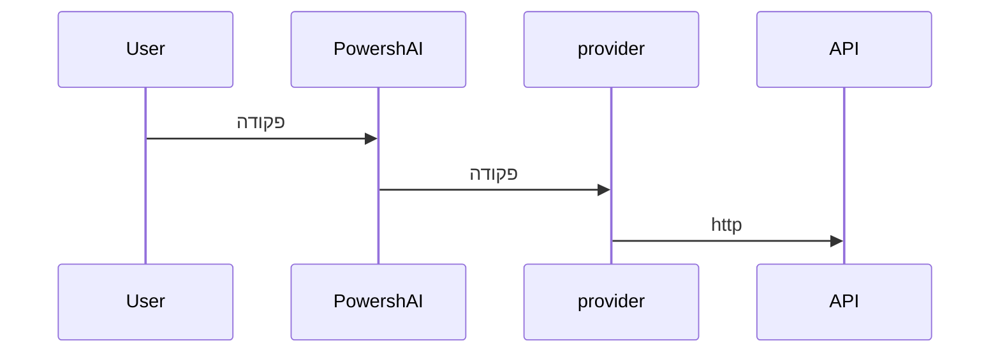

# ספקים  

# סיכום <!--! @#Short --> 

ספקים הם סקריפטים בתוך PowershAI המכילים את הלוגיקה לתקשורת וטיפול בתגובות מ-APIs של שירותי AI.

# פרטים  <!--! @#Long --> 

אחד מעמודי התווך של PowershAI הם ספקים.  
ספקים מיישמים את הפקודות שגולשות ל-APIs ספציפיות.  

בפשטות, ספקים הם סקריפטים המכילים את הלוגיקה לשליחה וקבלת נתונים מ-APIs של ספק זה.  
בסקריפטים אלה נמצאת כל הלוגיקה הייחודית והספציפית לכל ספק.  
PowershAI מספק פונקציות גנריות, המתקנות את האופן בו שירותים מסוימים של AI נקראים.  



לדוגמא, ספק OpenAI מספק את הפונקציה `Get-OpenaiChat`, ששולחת השלמה של צ'אט ל-API של OpenAI, בהתאם לכללי התיעוד.  
ספק גוגל, מצד שני, מספק את הפונקציה `Invoke-GoogleGenerateContent`, ששולחת צ'אט ל-Gemini ומקבלת את התגובה.  
לצורך המשתמש, PowershAI מספק את הפקודה `Get-AiChat`, שיכולה לקרוא הן את `Get-OpenaiChat` או את `Invoke-GoogleGenerateContent`, בהתאם לספק הפעיל.  
פרמטרי  `Get-AiChat` הם סטנדרטיים ומתועדים, וכל ספק צריך למפות את הקריאות המתאימות.  
קיים תקן מתועד לגבי האופן בו ספקים צריכים ליישם את הפונקציות, כדי שיתאימו למערכת האקולוגית של PowershAI.  


למרות תקן זה, שמקל על שימוש בפקודות גלובליות של PowershAI, המשתמש חופשי להשתמש בפקודות ישירות מכל ספק.  
PowershAI לא מונע גישה לפקודות הבסיס של כל ספק, מה שהופך אותו לגמיש מאוד, ומאפשר למשתמש, בין השאר, לשנות ולתקן לפי הצורך (דרך פרוקסי, למשל).

הרעיון של PowershAI הוא להיות גמיש ברמות רבות:

-  להיות בעלי פקודות סטנדרטיות, שמאפשרות להחליף בקלות את ספק ה-AI עבור פעולות נפוצות, כמו צ'אט עם LLM 
-  לספק גישה ישירה לפקודות המקיף את הקריאות ל-APIs

## קבלת רשימת הספקים  

ניתן לקבל את רשימת הספקים המיושמים בכמה דרכים.  
הראשונה היא באמצעות הפקודה `Get-AiProviders`.  

אם אתה רואה את התיעוד הזה באמצעות Get-Help, אתה יכול להשתמש בפקודה Get-Help about_Powershell_`שםספק`, לקבלת פרטים נוספים.  
אם אתה רואה אותו דרך מאגר ה-Git, אתה יכול להתייעץ ישירות על ידי גישה לתיקייה המשנה עם שם הספק.

כמו כן, רשימת הספקים הנתמכים ו/או המיושמים ניתן למצוא בבעיה #3.


# דוגמאות <!--! @#Ex -->

## רשימת הספקים 

```powershell 
Get-AiProviders 
```

## רשימת עזרה על ספק ספציפי 

```
Get-Help about_Powershai_huggingface
Get-Help about_Powershai_openai
```


<!--PowershaiAiDocBlockStart-->
_תרגם אוטומטית באמצעות PowershAI ובינה מלאכותית. 
_
<!--PowershaiAiDocBlockEnd-->
