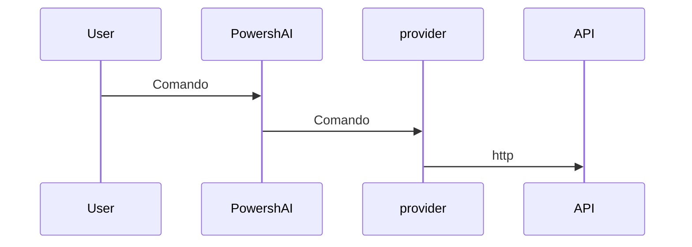

# Provider  

# RIASSUNTO <!--! @#Short --> 

I provider sono script all'interno di PowershAI che contengono la logica per comunicare e gestire le risposte dalle API dei servizi di intelligenza artificiale.

# DETTAGLI  <!--! @#Long --> 

Uno dei pilastri di PowershAI sono i provider.  
I provider implementano i comandi che accedono alle API specifiche.  

In sostanza, i provider sono script che contengono la logica per inviare e ricevere i dati dalle API di quel provider.  
In questi script è contenuta tutta la logica che è unica e peculiare di ogni provider.  
PowershAI fornisce funzioni generiche, che standardizzano il modo in cui vengono invocati alcuni servizi di intelligenza artificiale.  



Ad esempio, il provider OpenAI fornisce la funzione `Get-OpenaiChat`, che invia un completamento di chat all'API di OpenAI, seguendo le regole documentate.  
Il provider Google, invece, fornisce la funzione `Invoke-GoogleGenerateContent`, che gestisce la chat per Gemini e riceve la risposta.  
Per l'utente, PowershAI fornisce il comando `Get-AiChat`, che può sia invocare `Get-OpenaiChat` che `Invoke-GoogleGenerateContent`, a seconda del provider attivo.  
I parametri di `Get-AiChat` sono standardizzati e documentati, e ogni provider deve mappare le chiamate corrispondenti.  
Esiste uno standard documentato su come i provider devono implementare le funzioni per essere inseriti nell'ecosistema di PowershAI.  


Nonostante questa standardizzazione, che facilita l'utilizzo dei comandi globali di PowershAI, l'utente è libero di usare i comandi direttamente da ogni provider.  
PowershAI non impedisce l'accesso ai comandi base di ogni provider, e questo lo rende molto flessibile, permettendo all'utente anche di modificarli e adattarli in base alle proprie esigenze (tramite proxy, ad esempio).

L'idea di PowershAI è di essere flessibile a diversi livelli:

- Avere comandi standard, che consentono di cambiare facilmente il provider di intelligenza artificiale per operazioni comuni, come la chat con un LLM 
- Fornire accesso diretto ai comandi che incapsulano le chiamate alle API

## Ottenere l'elenco dei provider  

È possibile ottenere l'elenco dei provider implementati in diversi modi.  
Il primo è utilizzando il comando `Get-AiProviders`.  

Se stai visualizzando questa documentazione tramite Get-Help, puoi utilizzare il comando Get-Help about_Powershell_`NomeProvider`, per ottenere maggiori dettagli.  
Se stai visualizzando il repository Git, puoi consultare direttamente accedendo alla sottodirectory con il nome del provider.

Inoltre, l'elenco dei provider supportati e/o che stanno per essere implementati può essere controllato nell'issue #3.


# ESEMPI <!--! @#Ex -->

## Elencare i provider 

```powershell 
Get-AiProviders 
```

## Elencare l'help su un provider specifico 

```
Get-Help about_Powershai_huggingface
Get-Help about_Powershai_openai
```


<!--PowershaiAiDocBlockStart-->
_Tradotto automaticamente tramite PowerShell e IA. 
_
<!--PowershaiAiDocBlockEnd-->
