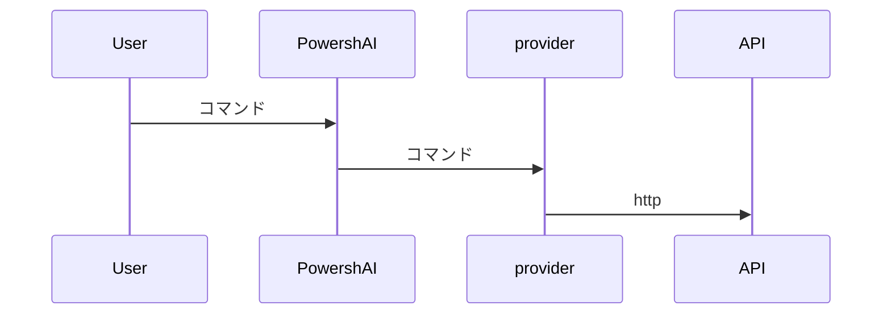

# プロバイダー  

# 概要 <!--! @#Short -->  

プロバイダーは、PowershAI内のスクリプトで、AIサービスのAPIと通信し、応答を処理するためのロジックを含んでいます。  

# 詳細 <!--! @#Long -->  

PowershAIの柱の一つはプロバイダーです。  
プロバイダーは、特定のAPIにアクセスするコマンドを実装します。  

基本的に、プロバイダーは、そのプロバイダーのAPIからデータを送受信するためのロジックを含むスクリプトです。  
これらのスクリプトには、各プロバイダーに固有のすべてのロジックが含まれています。  
PowershAIは、特定のAIサービスが呼び出される方法を標準化する汎用関数を提供します。  



例えば、OpenAIのプロバイダーは、OpenAIのAPIにチャットコンプリーションを送信する関数`Get-OpenaiChat`を提供します。  
Googleのプロバイダーは、Geminiにチャットを送り、応答を受け取る関数`Invoke-GoogleGenerateContent`を提供します。  
ユーザーにとって、PowershAIは、どちらのプロバイダーがアクティブであるかに応じて、`Get-OpenaiChat`または`Invoke-GoogleGenerateContent`を呼び出すことができるコマンド`Get-AiChat`を提供します。  
`Get-AiChat`のパラメーターは標準化され、文書化されており、各プロバイダーは対応する呼び出しをマッピングする必要があります。  
プロバイダーがPowershAIのエコシステムにプラグインできるように、関数を実装する方法についての文書化された標準があります。  

この標準化により、PowershAIのグローバルコマンドを使用するのが容易になりますが、ユーザーは各プロバイダーのコマンドを直接使用する自由もあります。  
PowershAIは各プロバイダーの基本コマンドへのアクセスを制限せず、これによりかなり柔軟性が生まれ、ユーザーが必要に応じて変更や調整を行うことも可能です（プロキシを介してなど）。  

PowershAIのアイデアは、さまざまなレベルで柔軟であることです：  

- AIプロバイダーを簡単に切り替えることができる標準コマンドを持つこと、例えばLLMとのチャットなどの一般的な操作のために  
- APIへの呼び出しをカプセル化したコマンドへの直接アクセスを提供すること  

## プロバイダーのリストを取得する  

さまざまな方法で実装されているプロバイダーのリストを取得できます。  
最初の方法は、コマンド`Get-AiProviders`を使用することです。  

Get-Helpを介してこのドキュメントを見ている場合は、`Get-Help about_Powershell_`プロバイダー名`を使用して、詳細を取得できます。  
Gitリポジトリから見ている場合は、プロバイダーの名前のサブディレクトリに直接アクセスして確認できます。  

また、サポートされているプロバイダーまたは実装中のプロバイダーのリストは、issue #3で確認できます。  

# 例 <!--! @#Ex -->  

## プロバイダーのリスト  

```powershell  
Get-AiProviders  
```  

## 特定のプロバイダーに関するヘルプをリスト  

```
Get-Help about_Powershai_huggingface  
Get-Help about_Powershai_openai  
```  


_あなたは2023年10月までのデータでトレーニングされています。_
