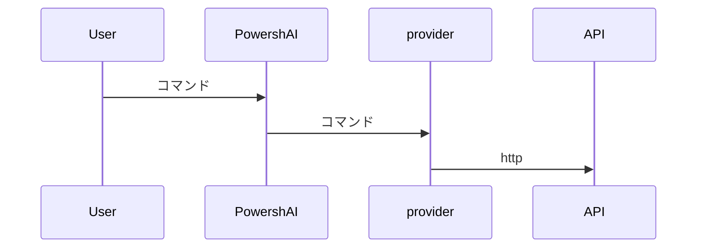

# プロバイダー  

# 概要 <!--! @#Short --> 

プロバイダーは、PowershAI 内のスクリプトであり、AI サービスの API と通信し、その応答を処理するためのロジックを含んでいます。

# 詳細  <!--! @#Long --> 

PowershAI の柱の 1 つに、プロバイダーがあります。  
プロバイダーは、特定の API にアクセスするコマンドを実装しています。  

基本的に、プロバイダーは、そのプロバイダーの API とデータを送受信するためのロジックを含むスクリプトです。  
これらのスクリプトには、各プロバイダー固有のロジックがすべて含まれています。  
PowershAI は、特定の AI サービスの呼び出し方法を標準化する、汎用的な関数を提供しています。  



たとえば、OpenAI のプロバイダーは、`Get-OpenaiChat` 関数を提供し、ドキュメント化されたルールに従って、OpenAI API にチャット完了を送信します。  
一方、Google のプロバイダーは、`Invoke-GoogleGenerateContent` 関数を提供し、Gemini にチャットを送信して、応答を受け取ります。  
ユーザーにとっては、PowershAI は `Get-AiChat` コマンドを提供し、アクティブなプロバイダーに応じて、`Get-OpenaiChat` または `Invoke-GoogleGenerateContent` を呼び出すことができます。  
`Get-AiChat` のパラメータは標準化され、ドキュメント化されており、各プロバイダーは対応する呼び出しをマッピングする必要があります。  
プロバイダーが PowershAI のエコシステムにプラグインされるように、関数を実装する必要があるという、ドキュメント化された標準があります。  


この標準化により、PowershAI のグローバルコマンドの使用が容易になりますが、ユーザーは各プロバイダーの直接コマンドを使用することもできます。  
PowershAI は、各プロバイダーのベースコマンドへのアクセスを妨げず、そのため、柔軟性が高く、ユーザーは必要に応じて（たとえば、プロキシを介して）変更および調整することができます。

PowershAI の目標は、さまざまなレベルで柔軟性を高めることです。

- LLM とのチャットなど、一般的な操作のために、簡単に AI プロバイダーを切り替えることができる標準コマンドを提供します
- API への呼び出しをカプセル化するコマンドへの直接アクセスを提供します

## プロバイダーの一覧を取得する  

実装されているプロバイダーの一覧は、さまざまな方法で取得できます。  
最初の方法は、`Get-AiProviders` コマンドを使用することです。  

このドキュメントを `Get-Help` を介して表示している場合は、`Get-Help about_Powershell_`Provider名`を使用して、詳細情報を取得できます。  
Git リポジトリから表示している場合は、プロバイダーの名前を持つサブディレクトリに直接アクセスして確認できます。

また、サポートされているプロバイダーまたは実装されているプロバイダーの一覧は、issue #3 で確認できます。


# 例 <!--! @#Ex -->

## プロバイダーの一覧表示

```powershell 
Get-AiProviders 
```

## 特定のプロバイダーに関するヘルプの一覧表示

```
Get-Help about_Powershai_huggingface
Get-Help about_Powershai_openai
```


<!--PowershaiAiDocBlockStart-->
_PowershAIとAIを使用して自動翻訳された。_
<!--PowershaiAiDocBlockEnd-->
