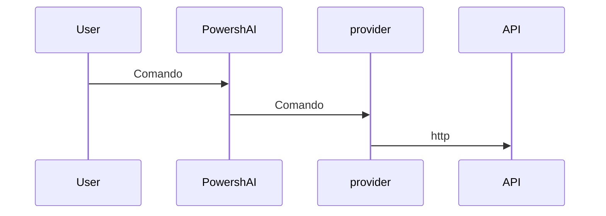

# Providers  

# SHORT DESCRIPTION

Providers são scripts dentro do PowershAI que contém a lógica para se comunicar e trata a respostas das APIs dos serviços de IA.

# LONG DESCRIPTION

Um dos pilares do PowershAI são os providers.  
Os providers implementam os comandos que acessam as APIs específicas.  

Basicamente, os providers são scripts que contém a lógica para enviar e receber os dados das APIs daquele provider.  
Nesses scripts está toda a lógica que é única e peculiar de cada provider.  
O PowershAI provê funções genéricas, que padroniza a maneira como certos serviços de IA são invocados.  



Por exemplo, o provider da OpenAI fornece a função `Get-OpenaiChat`, que envia um chat completion para a API da OpenAI, seguindo as regras documentadas.  
Já o provider do Google, fornece a função `Invoke-GoogleGenerateContent`, que o chat para o Gemini e recebe a resposta.  
Para o usuário, o powershai fornece o comando `Get-AiChat`, que pode tanto invocar a `Get-OpenaiChat` ou a `Invoke-GoogleGenerateContent`, dependendo de qual provider está ativo.  
Os parâmetros de  `Get-AiChat` são padronizados e documentados, e, cada provider, deve mapear as chamadas correspondente.  
Há um padrão documentado de como os providers devem implementar as funções para que elas sejam plugadas no ecossistema do PowershAI.  


Apesar dessa padronização, que facilita usar os comandos globais do PowershAI, o usuário é livre para usar os comandos diretamente de cada provider.  
O PowershAI não impede o acesso aos comandos base de cada provider, e isso o torna bastante flexível, permitind, inclusive, que usuário modifique e ajuste conforme necessidade (via proxy, por exemplo).

A ideia do PowershAI é ser flexível em vários níveis:

- Ter comandos padrões, que permitem facilmente trocar o provider de IA para operações comuns, como chat com um LLM 
- Fornecer acesso direto aos comandos que encapsulam as chamadas às APIs

## Obtendo a lista de providers  

Você pode obter a lista de providers implementandos de várias maneiras.  
A primeira é utilizando o comando `Get-AiProviders`.  

Se você está vendo essa documentação via Get-Help, você pode usar o comando Get-Help about_Powershell_`NomeProvider`, para obter mais detalhes.  
Se está vendo pelo repositório Git, você pode consultar diretamente acessando o subdiretório com o nome do provider.


# EXAMPLES

## Listando os providers 

```powershell 
Get-AiProviders 
```

## Listando o help sobre um provider específico 

```
Get-Help about_Powershai_huggingface
Get-Help about_Powershai_openai
```

